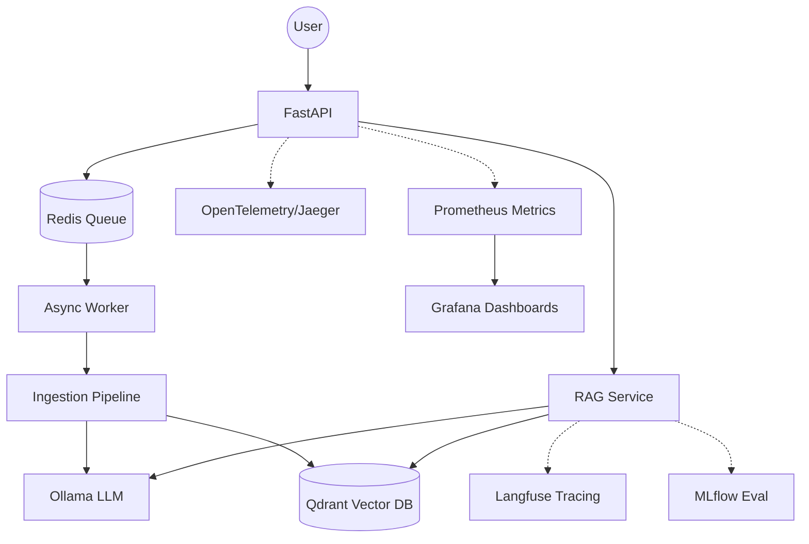

# LLM-RAG Platform 🚀

LLM-RAG is an enterprise-grade, open-source RAG (Retrieval-Augmented Generation) and LLMOps platform designed for local-first execution. It provides a modular architecture for document ingestion, semantic search, and context-aware LLM generation, with a heavy focus on professional observability and asynchronous processing.

## 🏗️ Architecture



## 🛠️ Stack Tecnológica

| Componente | Tecnologia | Propósito |
|------------|------------|-----------|
| **Backend** | FastAPI | High-performance API orchestration. |
| **Inference** | Ollama | Local serving of LLMs (Llama 3, Qwen) and Embeddings. |
| **Vector DB** | Qdrant | Semantic search and metadata filtering. |
| **Tracing** | Langfuse | Prompt management and detailed trace spans. |
| **Distributed Tracing** | Jaeger | OpenTelemetry-based system-wide tracing. |
| **Task Queue** | Redis | Asynchronous background ingestion. |
| **Metrics** | Prometheus | Real-time monitoring and alerting. |
| **Visualization** | Grafana | Infrastructure and LLM performance dashboards. |
| **Evaluation** | Ragas | Systematic evaluation of RAG faithfulness and relevance. |

## 🚀 Como Executar

### Pré-requisitos
- Docker & Docker Compose
- Python 3.11+ (para desenvolvimento local)

### Passo a Passo

1. **Clonar o repositório**
   ```bash
   git clone https://github.com/cayoesn/llm-rag
   cd llm-rag
   ```

2. **Configurar o Ambiente**
   ```bash
   cp .env.example .env
   # Edite o .env conforme necessário
   ```

3. **Subir os Containers**
   ```bash
   make up
   ```

4. **Ollama Setup**
   Após os containers subirem, baixe os modelos:
   ```bash
   docker exec -it llm_rag_ollama ollama pull llama3
   docker exec -it llm_rag_ollama ollama pull nomic-embed-text
   ```

## 📊 Observabilidade & LLMOps

A plataforma vem pré-configurada com as seguintes credenciais para facilitar o primeiro acesso:

| Serviço | URL | Usuário / Email | Senha |
|------------|-----|-----------------|-------|
| **Langfuse** | `http://localhost:3000` | `admin@llmrag.com` | `admin123` |
| **Grafana** | `http://localhost:3001` | `admin` | `admin` |
| **Jaeger** | `http://localhost:16686` | *(Sem Login)* | - |
| **MLflow** | `http://localhost:5000` | *(Sem Login)* | - |
| **Qdrant DB** | `http://localhost:6333/dashboard` | *(Sem Login)* | - |
| **FastAPI Docs** | `http://localhost:8000/docs` | *(Sem Login)* | - |

> **Nota:** As chaves de API do Langfuse já foram geradas automaticamente e injetadas no serviço da API. Você pode começar a testar e os traces aparecerão instantaneamente.

## 🔌 Rotas da API

A API FastAPI fornece os seguintes endpoints para interação:

### 1. **GET /health** - Health Check
Verifica se a API está rodando e saudável.

**Request:**
```bash
curl http://localhost:8000/health
```

**Response (200 OK):**
```json
{
  "status": "healthy"
}
```

---

### 2. **POST /chat** - Chat com RAG
Envia uma pergunta e recebe uma resposta gerada pelo RAG com contexto recuperado.

**Request:**
```bash
curl -X POST http://localhost:8000/chat \
  -H "Content-Type: application/json" \
  -d '{
    "message": "O que é retrieval augmented generation?"
  }'
```

**Request Body (JSON):**
```json
{
  "message": "Sua pergunta aqui"
}
```

**Response (200 OK):**
```json
{
  "answer": "Retrieval Augmented Generation (RAG) é uma técnica que combina...",
  "context": [
    {
      "id": "doc_1",
      "content": "RAG é um padrão arquitetural que...",
      "metadata": {
        "source": "documento.pdf",
        "page": 1
      }
    },
    {
      "id": "doc_2",
      "content": "A retrieval augmented generation melhora a qualidade...",
      "metadata": {
        "source": "outro_documento.pdf",
        "page": 3
      }
    }
  ],
  "model": "llama3"
}
```

**Python Example:**
```python
import requests

url = "http://localhost:8000/chat"
payload = {"message": "O que é RAG?"}
response = requests.post(url, json=payload)
print(response.json())
```

---

### 3. **POST /ingest** - Upload e Indexação de PDF
Faz upload de um arquivo PDF para ser processado e indexado de forma assíncrona.

**Request:**
```bash
curl -X POST http://localhost:8000/ingest \
  -F "file=@seu_documento.pdf"
```

**Response (200 OK):**
```json
{
  "message": "File uploaded and ingestion started",
  "job_id": "550e8400-e29b-41d4-a716-446655440000",
  "file_id": "abc123def456"
}
```

**Python Example:**
```python
import requests

url = "http://localhost:8000/ingest"
with open("documento.pdf", "rb") as f:
    files = {"file": f}
    response = requests.post(url, files=files)
    print(response.json())
```

**Shell Script Example (Linux/macOS):**
```bash
#!/bin/bash

PDF_FILE="documento.pdf"

# Upload do PDF
RESPONSE=$(curl -s -X POST http://localhost:8000/ingest \
  -F "file=@$PDF_FILE")

# Extrair job_id
JOB_ID=$(echo $RESPONSE | grep -o '"job_id":"[^"]*' | cut -d'"' -f4)

echo "Upload concluído!"
echo "Job ID: $JOB_ID"
echo "Status: $RESPONSE"

# (Opcional) Monitorar progresso
sleep 2
echo "Processamento em segundo plano. Use /health para confirmar que a API está ativa."
```

**Notas sobre /ingest:**
- ✅ Apenas arquivos PDF são aceitos
- ✅ Processamento é assíncrono (a resposta é imediata, indexação ocorre em background)
- ✅ Arquivos grandes podem levar alguns minutos para processar
- ✅ Embeddings e contextos são armazenados no Qdrant após processamento
- ✅ O `job_id` pode ser usado para rastrear o status da tarefa no Redis

---

## 📚 Estrutura de Resposta - /chat

| Campo | Tipo | Descrição |
|-------|------|-----------|
| `answer` | string | Resposta gerada pelo LLM baseada no contexto |
| `context` | array | Lista de documentos recuperados do Qdrant |
| `model` | string | Nome do modelo LLM utilizado (ex: "llama3") |

**Estrutura de um documento no context:**
```json
{
  "id": "unique_doc_id",
  "content": "Texto do documento...",
  "metadata": {
    "source": "nome_do_arquivo.pdf",
    "page": 1,
    "chunk": 0
  }
}
```

---

## 🧪 Conceitos de LLMOps Aplicados

- **Semantic Caching**: Redução de latência usando Redis para queries similares.
- **Async Ingestion**: Workers independentes para processamento de PDFs pesados.
- **Structured Logging**: Logs em JSON para fácil integração com ELK/Loki.
- **Retry Logic**: Resiliência em chamadas de API usando Tenacity.
- **RAG Evaluation**: Métricas de Faithfulness e Answer Relevance com Ragas.
