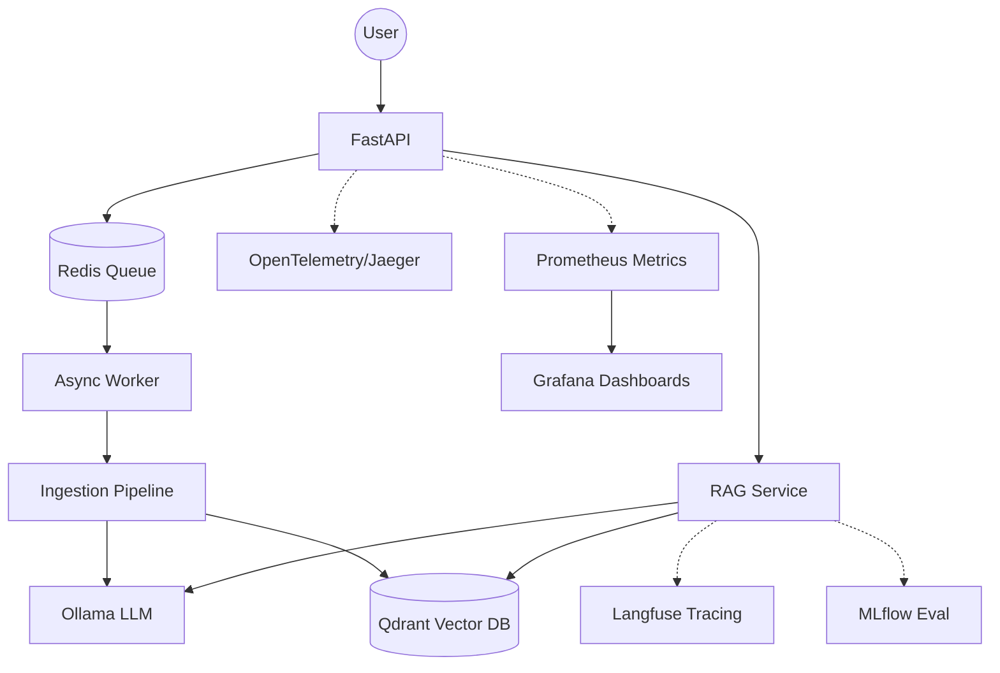

# LLM-RAG Platform 🚀

LLM-RAG is an enterprise-grade, open-source RAG (Retrieval-Augmented Generation) and LLMOps platform designed for local-first execution. It provides a modular architecture for document ingestion, semantic search, and context-aware LLM generation, with a heavy focus on professional observability and asynchronous processing.

## 🏗️ Architecture



## 🛠️ Stack Tecnológica

| Componente | Tecnologia | Propósito |
|------------|------------|-----------|
| **Backend** | FastAPI | High-performance API orchestration. |
| **Inference** | Ollama | Local serving of LLMs (Llama 3, Qwen) and Embeddings. |
| **Vector DB** | Qdrant | Semantic search and metadata filtering. |
| **Tracing** | Langfuse | Prompt management and detailed trace spans. |
| **Distributed Tracing** | Jaeger | OpenTelemetry-based system-wide tracing. |
| **Task Queue** | Redis | Asynchronous background ingestion. |
| **Metrics** | Prometheus | Real-time monitoring and alerting. |
| **Visualization** | Grafana | Infrastructure and LLM performance dashboards. |
| **Evaluation** | Ragas | Systematic evaluation of RAG faithfulness and relevance. |

## 🚀 Como Executar

### Pré-requisitos
- Docker & Docker Compose
- Python 3.11+ (para desenvolvimento local)

### Passo a Passo

1. **Clonar o repositório**
   ```bash
   git clone https://github.com/cayoesn/llm-rag
   cd llm-rag
   ```

2. **Configurar o Ambiente**
   ```bash
   cp .env.example .env
   # Edite o .env conforme necessário
   ```

3. **Subir os Containers**
   ```bash
   make up
   ```

4. **Ollama Setup**
   Após os containers subirem, baixe os modelos:
   ```bash
   docker exec -it llm_rag_ollama ollama pull llama3
   docker exec -it llm_rag_ollama ollama pull nomic-embed-text
   ```

## 📊 Observabilidade & LLMOps

- **Langfuse**: Acesse em `http://localhost:3000` para ver traces de prompts.
- **Jaeger**: Acesse em `http://localhost:16686` para tracing distribuído.
- **MLflow**: Acesse em `http://localhost:5000` para tracking de experimentos.
- **Grafana**: Acesse em `http://localhost:3001` (admin/admin).

## 🧪 Conceitos de LLMOps Aplicados

- **Semantic Caching**: Redução de latência usando Redis para queries similares.
- **Async Ingestion**: Workers independentes para processamento de PDFs pesados.
- **Structured Logging**: Logs em JSON para fácil integração com ELK/Loki.
- **Retry Logic**: Resiliência em chamadas de API usando Tenacity.
- **RAG Evaluation**: Métricas de Faithfulness e Answer Relevance com Ragas.
