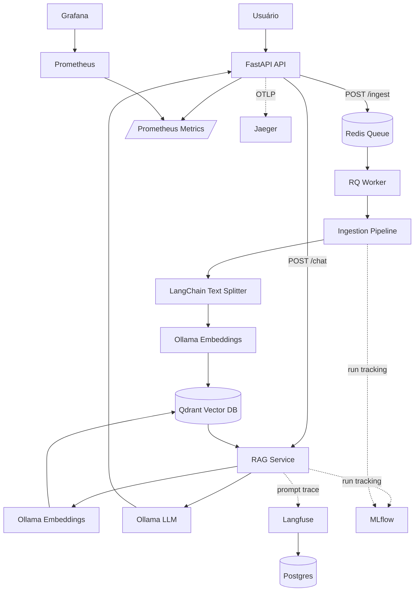

# LLM-RAG Platform


> Plataforma local-first para RAG, LLMOps e observabilidade.

Este projeto combina API, fila assíncrona, banco vetorial, modelos locais, tracing, métricas e tracking de experimentos em um fluxo completo de ingestão de documentos e pergunta-resposta com RAG.

A aplicação permite enviar PDFs, processar o conteúdo em background, armazenar embeddings no Qdrant, consultar documentos semanticamente e gerar respostas com modelos locais via Ollama, mantendo observabilidade com Prometheus, Grafana, Jaeger, Langfuse e MLflow.

## 📚 Sumário

- [🧭 Visão Geral](#visao-geral)
- [🏗️ Arquitetura](#arquitetura)
- [🔄 Fluxos do Projeto](#fluxos-do-projeto)
- [🧰 Tecnologias e Serviços](#tecnologias-e-servicos)
- [📁 Estrutura do Repositório](#estrutura-do-repositorio)
- [🚀 Instalação](#instalacao)
- [🧪 Como Usar](#como-usar)
- [🔎 Como Verificar Cada Serviço](#como-verificar-cada-servico)
- [📊 Observabilidade](#observabilidade)
- [✅ Testes e Coverage](#testes-e-coverage)
- [🛠️ Troubleshooting](#troubleshooting)

<a id="visao-geral"></a>

## 🧭 Visão Geral

Este projeto implementa um fluxo RAG com duas jornadas principais:

1. Ingestão de PDF: o usuário envia um PDF para a API, a tarefa é enviada para uma fila Redis, um worker processa o arquivo, gera chunks, cria embeddings no Ollama e grava vetores no Qdrant.
2. Chat com RAG: o usuário envia uma pergunta, a API gera embedding da pergunta, busca documentos semelhantes no Qdrant, monta o prompt com contexto e chama um LLM local via Ollama.

Além do fluxo funcional, a plataforma inclui:

- métricas HTTP e runtime expostas para Prometheus;
- dashboards manuais no Grafana;
- tracing distribuído com OpenTelemetry e Jaeger;
- tracking de runs com MLflow;
- tracing de prompts com Langfuse quando configurado;
- testes automatizados com coverage mínimo de 80%.

<a id="arquitetura"></a>

## 🏗️ Arquitetura



<a id="fluxos-do-projeto"></a>

## 🔄 Fluxos do Projeto

### 📥 Fluxo 1: Ingestão de Documento

1. O usuário envia um PDF em `POST /ingest`.
2. A API valida a extensão `.pdf`.
3. O arquivo é salvo em `uploads/`.
4. A API cria um job na fila Redis `ingestion_tasks`.
5. O worker consome o job.
6. `IngestionPipeline` carrega o PDF com `PyPDFLoader`.
7. O texto é quebrado em chunks com `RecursiveCharacterTextSplitter`.
8. Cada chunk vira embedding usando o modelo `nomic-embed-text` no Ollama.
9. A coleção `llm_rag_docs` é criada no Qdrant, se ainda não existir.
10. Os vetores e payloads são gravados no Qdrant.
11. A execução é registrada no MLflow como run de ingestão.

### 💬 Fluxo 2: Pergunta com RAG

1. O usuário envia uma pergunta em `POST /chat`.
2. `RAGService` gera embedding da pergunta com Ollama.
3. O Qdrant busca os chunks semanticamente mais próximos.
4. A aplicação monta um prompt com o contexto recuperado.
5. O Ollama gera a resposta com o modelo definido em `LLM_MODEL`.
6. A resposta retorna junto com os documentos de contexto.
7. A execução é registrada no MLflow e, se disponível, no Langfuse.
8. Spans OpenTelemetry são exportados para o Jaeger.

<a id="tecnologias-e-servicos"></a>

## 🧰 Tecnologias e Serviços

| Serviço | Tecnologia | Porta | Por que foi incluído | O que verificar |
|---|---:|---:|---|---|
| 🌐 API | FastAPI | `8000` | Expõe os endpoints HTTP do produto e orquestra o fluxo RAG. | `/docs`, `/health`, `/metrics`, chamadas `/chat` e `/ingest`. |
| ⚙️ Worker | RQ Worker | interno | Processa PDFs fora do request HTTP para não bloquear a API. | Logs do container `llm_rag_worker`. |
| 📬 Fila | Redis | `6379` | Guarda jobs assíncronos de ingestão. | `redis-cli ping`, tamanho da fila e logs. |
| 🧠 LLM local | Ollama | `11434` | Serve modelos locais de geração e embeddings. | `ollama list`, chamadas ao endpoint `/api/tags`. |
| 🧲 Vector DB | Qdrant | `6333`, `6334` | Armazena embeddings e permite busca semântica. | Dashboard, coleção `llm_rag_docs`, pontos inseridos. |
| 🧾 Experimentos | MLflow | `5000` | Registra runs de ingestão, chat, métricas, parâmetros e artefatos. | Experiments, runs, artifacts. |
| 🔍 Prompt tracing | Langfuse | `3000` | Permite investigar chamadas de LLM e prompts. | Traces do projeto `LLM-RAG Project`. |
| 📈 Métricas | Prometheus | `9090` | Coleta métricas da API e do próprio Prometheus. | Targets `UP`, queries e scrape da API. |
| 📊 Visualização | Grafana | `3001` | Cria dashboards a partir do Prometheus. | Datasource Prometheus e painéis. |
| 🧵 Tracing | Jaeger | `16686`, `4317`, `4318` | Visualiza spans OpenTelemetry da API e do RAG. | Service `llm_rag_api`, traces de `/chat`. |
| 🗄️ Metadata DB | Postgres | `5432` | Banco usado pelo Langfuse. | Healthcheck e tabelas do Langfuse. |

<a id="estrutura-do-repositorio"></a>

## 📁 Estrutura do Repositório

```text
api/                    FastAPI app, endpoints e métricas HTTP
config/                 Configurações lidas do .env
docker/                 Dockerfiles da API e do worker
embeddings/             Cliente de embeddings via Ollama
ingestion/              Pipeline de ingestão de PDF
observability/          Configuração do Prometheus
qdrant/                 Gerenciador do banco vetorial
rag/                    Serviço RAG e template de prompt
shared/                 Logging, MLflow e OpenTelemetry
tests/                  Testes unitários e integração
uploads/                PDFs recebidos pela API
worker/                 Worker RQ que processa ingestão
docker-compose.yml      Stack completa local
Makefile                Comandos de operação
requirements.txt        Dependências Python
```

<a id="instalacao"></a>

## 🚀 Instalação

### 📋 Pré-requisitos

- Docker e Docker Compose
- Python 3.11+ para desenvolvimento local
- `make` opcional, mas recomendado

No Windows, os comandos abaixo podem ser executados no PowerShell. Se não tiver `make`, use os comandos `docker compose` equivalentes.

### 1. 🧩 Configurar ambiente

```bash
cp .env.example .env
```

Revise o `.env`. Para uso via Docker, os hosts internos devem apontar para os nomes dos serviços:

```env
OLLAMA_BASE_URL="http://ollama:11434"
QDRANT_HOST="qdrant"
REDIS_HOST="redis"
MLFLOW_TRACKING_URI="http://mlflow:5000"
OTEL_EXPORTER_OTLP_ENDPOINT="http://jaeger:4317"
LANGFUSE_HOST="http://langfuse:3000"
```

### 2. 🐳 Subir a stack

```bash
make up
```

Equivalente:

```bash
docker compose up -d --build
```

### 3. 🧠 Baixar modelos no Ollama

Depois que o container `llm_rag_ollama` estiver saudável:

```bash
docker exec -it llm_rag_ollama ollama pull llama3
docker exec -it llm_rag_ollama ollama pull nomic-embed-text
```

Verifique:

```bash
docker exec -it llm_rag_ollama ollama list
```

### 4. ✅ Verificar containers

```bash
docker compose ps
```

Todos os serviços principais devem estar `running` ou `healthy`.

<a id="como-usar"></a>

## 🧪 Como Usar

### 🩺 Health check

```bash
curl http://localhost:8000/health
```

Resposta esperada:

```json
{"status":"healthy"}
```

### 📖 Documentação interativa da API

Acesse:

```text
http://localhost:8000/docs
```

### 📥 Ingerir um PDF

```bash
curl -X POST http://localhost:8000/ingest \
  -F "file=@documento.pdf"
```

Resposta esperada:

```json
{
  "message": "File uploaded and ingestion started",
  "job_id": "job-id",
  "file_id": "uuid"
}
```

O processamento é assíncrono. Para acompanhar:

```bash
docker logs -f llm_rag_worker
docker logs -f llm_rag_api
```

### 💬 Fazer uma pergunta

```bash
curl -X POST http://localhost:8000/chat \
  -H "Content-Type: application/json" \
  -d "{\"message\":\"O que o documento fala sobre RAG?\"}"
```

Resposta esperada:

```json
{
  "answer": "Resposta gerada pelo LLM...",
  "context": [
    {
      "id": "point-id",
      "content": "chunk recuperado...",
      "metadata": {
        "source": "documento.pdf",
        "page": 1
      }
    }
  ],
  "model": "llama3"
}
```

<a id="como-verificar-cada-servico"></a>

## 🔎 Como Verificar Cada Serviço

### 🌐 FastAPI

Use a API para validar se a aplicação está respondendo:

```bash
curl http://localhost:8000/health
curl http://localhost:8000/metrics
```

Abra a documentação:

```text
http://localhost:8000/docs
```

O que observar:

- `GET /health` retorna `healthy`;
- `POST /ingest` aceita apenas PDF;
- `POST /chat` retorna `answer`, `context` e `model`;
- `GET /metrics` expõe métricas para o Prometheus.

### ⚙️ Worker

O worker executa `worker/main.py` e consome a fila Redis `ingestion_tasks`.

Ver logs:

```bash
docker logs -f llm_rag_worker
```

O que observar depois de um upload:

- mensagem de início do processamento;
- split do PDF em chunks;
- upsert no Qdrant;
- logs de sucesso ou erro.

### 📬 Redis

Redis é usado como broker da fila RQ.

Verificar conexão:

```bash
docker exec -it llm_rag_redis redis-cli ping
```

Resposta esperada:

```text
PONG
```

Verificar fila:

```bash
docker exec -it llm_rag_redis redis-cli LLEN rq:queue:ingestion_tasks
```

Durante processamento, a fila pode subir e depois voltar para `0`.

### 🧠 Ollama

Ollama serve dois tipos de modelo:

- `LLM_MODEL`: geração de resposta, por padrão `llama3`;
- `EMBEDDING_MODEL`: embeddings, por padrão `nomic-embed-text`.

Verificar modelos instalados:

```bash
docker exec -it llm_rag_ollama ollama list
```

Testar geração:

```bash
docker exec -it llm_rag_ollama ollama run llama3 "Resuma RAG em uma frase"
```

Testar API:

```bash
curl http://localhost:11434/api/tags
```

### 🧲 Qdrant Dashboard

Acesse:

```text
http://localhost:6333/dashboard
```

O que verificar:

- coleção `llm_rag_docs`;
- quantidade de pontos após uma ingestão;
- payloads com `content`, `metadata` e `chunk_index`;
- dimensão dos vetores compatível com o modelo de embedding.

Verificar via API:

```bash
curl http://localhost:6333/collections
```

Após ingerir documentos, a coleção esperada é:

```text
llm_rag_docs
```

### 🧾 MLflow

Acesse:

```text
http://localhost:5000
```

MLflow registra runs de:

- queries RAG (`log_rag_run`);
- ingestão de documentos (`log_ingestion_run`);
- avaliações e métricas customizadas, quando chamadas pelo código.

O que verificar:

- experimento `Default`, caso nenhum experimento seja setado explicitamente;
- runs com nomes como `rag_query_...` e `ingest_...`;
- parâmetros como `question`, `model`, `context_count`, `file_name`;
- métricas como `latency_seconds`, `context_retrieved`, `pages_processed`, `chunks_created`;
- artefatos como `rag_output`, `metadata` e `ingestion_stats`.

Fluxo recomendado para validar:

1. Faça upload de um PDF.
2. Faça uma chamada `/chat`.
3. Abra o MLflow.
4. Entre no experimento `Default`.
5. Confira as runs criadas e seus artefatos.

### 🔍 Langfuse

Acesse:

```text
http://localhost:3000
```

Credenciais padrão:

```text
Email: admin@llmrag.com
Senha: admin123
```

Projeto inicial:

```text
LLM-RAG Project
```

Chaves configuradas no `.env`:

```env
LANGFUSE_PUBLIC_KEY="pk-lf-llmrag"
LANGFUSE_SECRET_KEY="sk-lf-llmrag"
```

O que verificar:

- se o login funciona;
- se o projeto inicial existe;
- se novas chamadas `/chat` aparecem como traces.

Nota: o código tenta usar a API disponível do SDK do Langfuse. Se a versão instalada não expuser o método esperado, a aplicação desativa o tracing de prompt e registra warning em log sem quebrar o `/chat`.

### 🧵 Jaeger

Acesse:

```text
http://localhost:16686
```

O que verificar:

1. Em `Service`, selecione `llm_rag_api`.
2. Clique em `Find Traces`.
3. Execute chamadas `/health`, `/ingest` ou `/chat`.
4. Confira spans HTTP e spans internos como `rag_answer_question`, `retrieval` e `generation`.

Jaeger recebe spans via OTLP gRPC:

```env
OTEL_EXPORTER_OTLP_ENDPOINT="http://jaeger:4317"
```

Se aparecer warning de exportação OTEL nos testes locais, normalmente significa que o Jaeger não está rodando naquele momento.

### 📈 Prometheus

Acesse:

```text
http://localhost:9090
```

O Prometheus está configurado em:

```text
observability/prometheus/prometheus.yml
```

Targets configurados:

- `prometheus`;
- `llm_rag_api` em `api:8000/metrics`.

O que verificar:

1. Abra `Status > Targets`.
2. Confirme que `llm_rag_api` está `UP`.
3. Execute queries como:

```promql
up
process_cpu_seconds_total
python_gc_objects_collected_total
```

Também é possível validar a origem diretamente:

```bash
curl http://localhost:8000/metrics
```

### 📊 Grafana

Acesse:

```text
http://localhost:3001
```

Credenciais padrão:

```text
Usuário: admin
Senha: admin
```

Este repositório sobe o Grafana, mas ainda não provisiona datasource e dashboards automaticamente. Para verificar manualmente:

1. Acesse `Connections > Data sources`.
2. Adicione `Prometheus`.
3. Use a URL interna:

```text
http://prometheus:9090
```

4. Clique em `Save & test`.
5. Crie um dashboard em `Dashboards > New`.

Sugestões de painéis:

| Painel | Query PromQL | Objetivo |
|---|---|---|
| Serviços ativos | `up` | Ver quais targets estão saudáveis. |
| CPU Python/API | `rate(process_cpu_seconds_total[5m])` | Observar consumo da aplicação. |
| Objetos GC | `rate(python_gc_objects_collected_total[5m])` | Sinal básico de atividade do runtime Python. |
| Scrape duration | `scrape_duration_seconds` | Ver latência de coleta do Prometheus. |

Para um case mais completo, o próximo passo natural é provisionar dashboards em `docker-compose` ou em `observability/grafana/`.

### 🗄️ Postgres

Postgres é usado pelo Langfuse como banco de metadata.

Verificar saúde:

```bash
docker exec -it llm_rag_postgres pg_isready -U postgres
```

Conectar:

```bash
docker exec -it llm_rag_postgres psql -U postgres -d llm_rag_db
```

Listar tabelas:

```sql
\dt
```

<a id="observabilidade"></a>

## 📊 Observabilidade

### 🧭 Onde olhar cada problema

| Problema | Primeiro lugar para olhar | Depois verificar |
|---|---|---|
| API fora do ar | `docker logs llm_rag_api` | FastAPI `/health`, Compose health. |
| PDF não indexa | `docker logs llm_rag_worker` | Redis queue, Qdrant collection, Ollama embeddings. |
| Chat sem contexto | Qdrant Dashboard | Se a coleção tem pontos e payload `content`. |
| Resposta lenta | Jaeger | Spans `retrieval` e `generation`. |
| LLM não responde | Ollama logs | Modelos instalados e endpoint `11434`. |
| Runs não aparecem | MLflow UI | `MLFLOW_TRACKING_URI` no `.env`. |
| Métricas não aparecem | Prometheus Targets | `/metrics` na API. |
| Dashboard vazio | Grafana datasource | URL interna `http://prometheus:9090`. |

### 🪵 Logs úteis

```bash
docker logs -f llm_rag_api
docker logs -f llm_rag_worker
docker logs -f llm_rag_ollama
docker logs -f llm_rag_qdrant
docker logs -f llm_rag_mlflow
```

### ⚡ Comandos gerais

```bash
make up          # sobe a stack
make down        # para a stack
make restart     # reinicia serviços
make ps          # lista containers
make logs        # segue logs do compose
make test        # roda testes com coverage >= 80%
```

<a id="testes-e-coverage"></a>

## ✅ Testes e Coverage

Instalar dependências localmente:

```bash
python -m venv .venv
.venv/Scripts/python -m pip install -r requirements.txt
```

Rodar testes:

```bash
make test
```

Ou diretamente:

```bash
.venv/Scripts/python -m pytest --cov=. --cov-report=term-missing --cov-fail-under=80
```

Configuração de coverage:

```text
.coveragerc
```

O projeto exige cobertura mínima de 80%. A configuração atual ignora `tests/` e `.venv/` para medir apenas código da aplicação.

## 🔐 Variáveis de Ambiente Principais

| Variável | Exemplo | Uso |
|---|---|---|
| `APP_NAME` | `LLM-RAG Platform` | Nome da aplicação FastAPI. |
| `OLLAMA_BASE_URL` | `http://ollama:11434` | URL interna do Ollama no Docker. |
| `LLM_MODEL` | `llama3` | Modelo de geração. |
| `EMBEDDING_MODEL` | `nomic-embed-text` | Modelo de embeddings. |
| `QDRANT_HOST` | `qdrant` | Host do Qdrant no Docker. |
| `QDRANT_COLLECTION_NAME` | `llm_rag_docs` | Coleção vetorial usada pelo RAG. |
| `REDIS_QUEUE_NAME` | `ingestion_tasks` | Nome da fila de ingestão. |
| `MLFLOW_TRACKING_URI` | `http://mlflow:5000` | Tracking server do MLflow. |
| `OTEL_EXPORTER_OTLP_ENDPOINT` | `http://jaeger:4317` | Exportador OTLP para Jaeger. |
| `LANGFUSE_HOST` | `http://langfuse:3000` | Host do Langfuse. |

<a id="troubleshooting"></a>

## 🛠️ Troubleshooting

### 🧠 `POST /chat` falha porque o modelo não existe

Baixe os modelos:

```bash
docker exec -it llm_rag_ollama ollama pull llama3
docker exec -it llm_rag_ollama ollama pull nomic-embed-text
```

### 🧲 Qdrant não mostra coleção

Ingestão ainda não rodou ou falhou. Verifique:

```bash
docker logs -f llm_rag_worker
curl http://localhost:6333/collections
```

### 📈 Prometheus target `llm_rag_api` está DOWN

Verifique se a API está ativa:

```bash
curl http://localhost:8000/metrics
docker compose ps api
```

Se a API estiver fora, veja:

```bash
docker logs llm_rag_api
```

### 📊 Grafana não conecta no Prometheus

Use a URL interna do Docker, não `localhost`:

```text
http://prometheus:9090
```

Dentro do container Grafana, `localhost` aponta para o próprio Grafana.

### 🧾 MLflow não mostra runs

Gere atividade primeiro:

```bash
curl -X POST http://localhost:8000/chat \
  -H "Content-Type: application/json" \
  -d "{\"message\":\"Teste de MLflow\"}"
```

Depois abra:

```text
http://localhost:5000
```

Procure no experimento `Default`.

### ⚙️ Worker não processa PDF

Verifique Redis, worker e uploads:

```bash
docker exec -it llm_rag_redis redis-cli ping
docker logs -f llm_rag_worker
docker exec -it llm_rag_worker ls -la /app/uploads
```

### 🧵 Warning de Jaeger/OTEL em execução local

Esse warning costuma aparecer quando a aplicação roda fora do Docker ou quando o Jaeger ainda não está pronto:

```text
Failed to export traces to jaeger:4317
```

Se estiver rodando localmente fora do Compose, ajuste:

```env
OTEL_EXPORTER_OTLP_ENDPOINT="http://localhost:4317"
```
